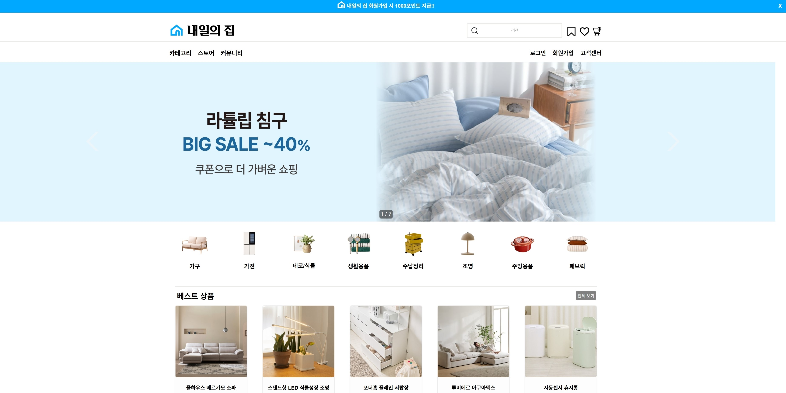

# 🏠 내일의 집 (Naeilhome)

[📄 이력서 보러가기](https://verbena-gerbil-44e.notion.site/1e32d31c7a6d807183c1d9b99589a8cb?pvs=4)   
 
[📘 프로젝트 상세 보기](https://verbena-gerbil-44e.notion.site/1e32d31c7a6d8021a0bbdb45e5602edc?pvs=4)  
[🗂️ 프로젝트 자료 모음](https://verbena-gerbil-44e.notion.site/Web-Project-1f12d31c7a6d801a9435e86ea3fe80fc?pvs=4)
 

 

## 📌 프로젝트 개요

- **1인 가구 증가**에 착안한 인테리어 쇼핑몰 + 커뮤니티 웹 애플리케이션  
- 커뮤니티 ‘내 집 소개’에서 인테리어 정보 공유 및 제품 연동 구매  
- **기획 → 설계 → 개발 → 테스트** 전 과정을 직접 수행한 팀 프로젝트  

 

## 🛠 사용 기술 스택

| 분류       | 기술                                                         |
|------------|--------------------------------------------------------------|
| **Web**    | Spring Boot, MyBatis, Maven                                  |
| **DB**     | Oracle                                                       |
| **Front**  | HTML5, CSS3, JSP, JavaScript, jQuery, Ajax, JSTL, Tiles      |
| **Server** | Apache Tomcat 9.0, AWS EC2, Docker                           |

 

## 💡 주요 기능

### ✔ 메인 페이지
- 프로젝트 대표 화면으로 사용자 친화적인 첫인상 제공

### ✔ 사용자 인증
- 이메일 인증 기반 회원가입/로그인 기능 구현 (SMTP 활용)

### ✔ 커뮤니티 기능
- 게시판 CRUD  
- 조회수 / 좋아요 / 댓글 수 실시간 반영  
- 사용자 간 정보 공유 공간 구성

### ✔ 쇼핑몰 기능
- 상품 상세 페이지 (다중 이미지)  
- 리뷰 작성 및 별점 등록  
- 장바구니 / 바로구매 기능 (수량 반영 로직 포함)

 

## 💻 담당 역할

- **메인 페이지 UI 설계 및 구현**  
- **회원가입 및 이메일 인증 기능 개발**  
- **게시판/댓글/좋아요 등 커뮤니티 기능 개발**  
- **상품 상세, 장바구니, 리뷰 등 쇼핑몰 기능 구현**  
- **GitHub를 통한 협업 및 형상 관리**

 

## 🎯 성과 및 경험

- **기획부터 배포까지 전체 개발 프로세스 경험**  
- 다양한 기술 스택 학습 및 실전 적용  
- 다중 이미지 처리, DB 오류 등 실무 문제 해결 능력 향상  
- Git 기반 협업과 코드 리뷰를 통한 팀워크 향상  
- 디자이너 경험을 살려 사용자 중심의 UI/UX 구현

 

## 📅 프로젝트 기간

- **2025.02.18 ~ 2025.04.25**
